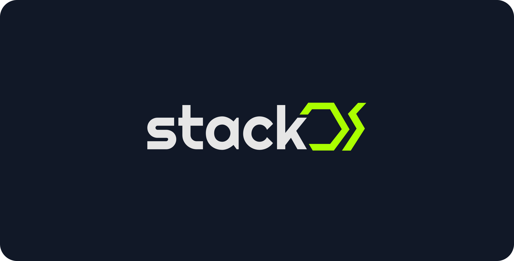

<!-- PROJECT LOGO -->
<a href="">
    
</a>

---

<!-- ABOUT THE PROJECT -->

## About project

This repository holds the remake of [Stackos App](https://app.stackos.io/) by 0xCarbon.

---

## Getting Started

This is a [Next.js](https://nextjs.org/) project bootstrapped with [`create-next-app`](https://github.com/vercel/next.js/tree/canary/packages/create-next-app).

Run the development server:

```bash
npm run dev
# or
yarn dev
```

---

## Running E2E tests

Run the development server:

```bash
npm run dev
# or
yarn dev
```

Run cypress:

```bash
npm run cypress
# or
yarn cypress
```

---
